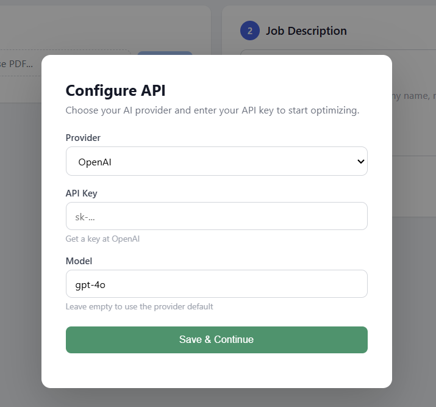
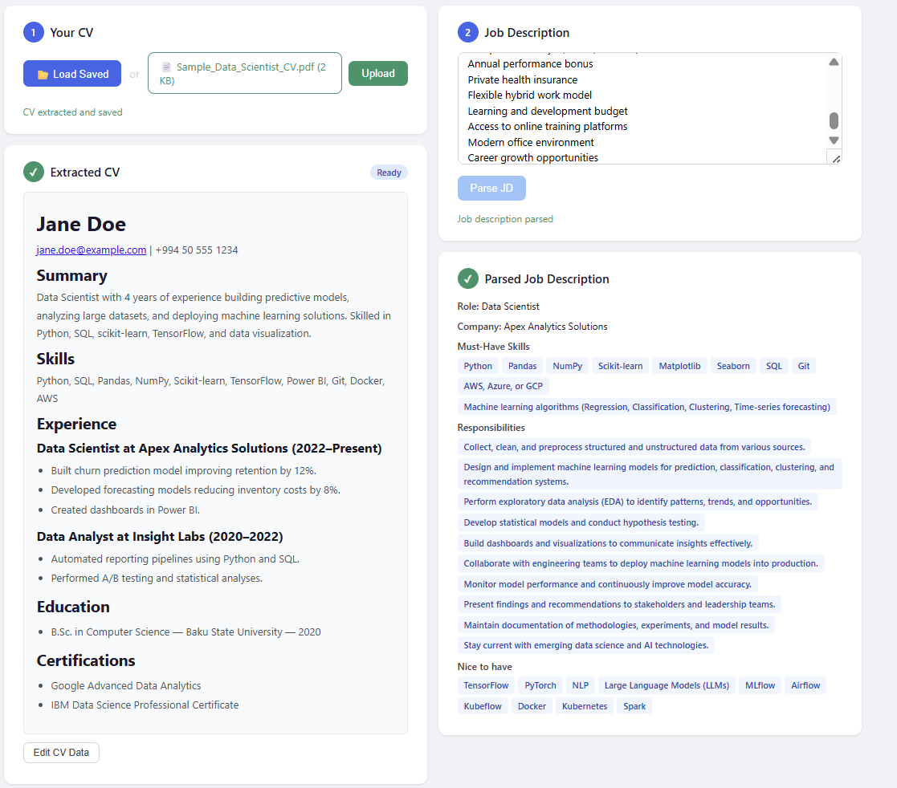
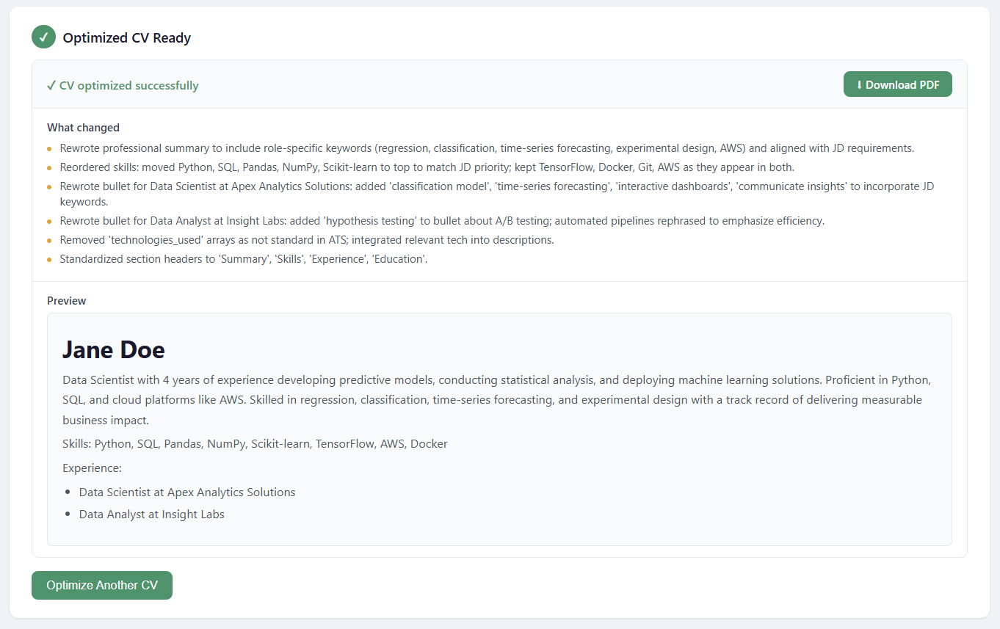

<h1 align="center">Resume Craft</h1>

<p align="center">
  
  
  
  
  
  
  
  
  <br>
  
  
  
</p>

<p align="center"><em>Upload your CV. Paste the job description. Download your tailored resume — in seconds.</em></p>

## Overview

AI-powered CV optimization tool. Upload your CV, paste a job description, and get an ATS-optimized resume PDF tailored to the role.
No fabrication — every rewrite stays truthful to your actual experience.

## Table of Contents

- [Overview](#overview)
- [Features](#features)
- [How It Works](#how-it-works)
- [Prerequisites](#prerequisites)
- [Quick Start](#quick-start)
- [Configuration](#configuration)
- [Docker](#docker)
- [Usage Walkthrough](#usage-walkthrough)
- [Project Structure](#project-structure)
- [Tech Stack](#tech-stack)
- [Privacy](#privacy)
- [Troubleshooting](#troubleshooting)
- [License](#license)

## Features

**PDF-to-structured-data extraction.** Upload any PDF resume and the app extracts your personal info, work experience, education, and skills into a structured, editable format. No manual data entry.

**Job description parsing.** Paste a job description and the app identifies the role title, company, must-have skills, nice-to-haves, and key responsibilities — giving you a clear picture of what the employer is looking for.

**AI-powered optimization.** The AI rewrites your CV to emphasize the experience and skills most relevant to the target role. Bullet points are reworded, sections are reordered, and the focus is adjusted — all while keeping every claim truthful. No hallucinated credentials or inflated titles.

**ATS-friendly PDF export.** Download a professional single-column PDF with clean typography, proper spacing, thin section rules, and clickable LinkedIn/GitHub links. Designed to pass applicant tracking systems.

**Multi-provider support.** Works with OpenCode, OpenAI, Ollama (fully local — no data leaves your machine), or any OpenAI-compatible API. Configure your provider and key once and the app remembers it.

**Edit before you optimize.** Review the extracted CV data, fix any parsing mistakes, and tweak the structure before sending it to the AI for optimization. Full control over what goes in.

**Everything runs locally.** The web UI is served from your own machine, your data stays in local files, and only the AI API call traverses the network. Your API key is stored in a gitignored config file.

## How It Works

1. **Upload your CV** (PDF) — text is extracted and structured into JSON by AI
2. **Paste a job description** — parsed into skills, requirements, and responsibilities
3. **Optimize** — AI rewrites your CV to highlight relevant experience for that specific role
4. **Download** — a professional PDF ready to submit

## Prerequisites

- Python 3.10+
- An API key for one of the supported providers, or Ollama running locally

## Quick Start

```bash
# Clone the repository
git clone https://github.com/<your-username>/resume-craft.git
cd resume-craft

# Create a virtual environment (recommended)
python -m venv .venv

# Activate it
# Windows:
.venv\Scripts\activate
# macOS / Linux:
source .venv/bin/activate

# Install dependencies
pip install -r requirements.txt

# Set up your API configuration
copy config.example.json config.json    # Windows
cp config.example.json config.json      # macOS / Linux

# Run the app
python run.py
```

Open http://127.0.0.1:8000 in your browser. If no API key is configured, a configuration modal will appear on first load.

## Configuration

### config.json

```json
{
  "provider": "opencode",
  "api_key": "your-api-key-here",
  "model": "",
  "api_base": "",
  "output_dir": "output"
}
```

| Field | Description |
|---|---|
| `provider` | One of: `opencode`, `openai`, `ollama`, `custom` |
| `api_key` | Your API key (not needed for Ollama) |
| `model` | Leave empty to use the provider default |
| `api_base` | Leave empty to use the provider default (required for `custom`) |
| `output_dir` | Directory where generated PDFs are saved |

Alternatively, you can leave `config.json` empty and configure everything through the in-browser modal on first launch.

### Supported Providers

| Provider | `provider` value | Default model | Needs API key | Default base URL |
|---|---|---|---|---|
| OpenCode | `opencode` | `deepseek-v4-flash-free` | Yes | `https://opencode.ai/zen/v1` |
| OpenAI | `openai` | `gpt-4o` | Yes | `https://api.openai.com/v1` |
| Ollama | `ollama` | `llama3` | No | `http://localhost:11434` |
| Custom | `custom` | — | Yes | — |

#### Ollama (Local)

If you want to run everything locally without sending data to any external API:

1. Install [Ollama](https://ollama.com)
2. Pull a model: `ollama pull llama3`
3. Set `"provider": "ollama"` in config.json (no API key needed)
4. Make sure Ollama is running before starting Resume Craft

#### Custom Provider

Any OpenAI-compatible API works. Set `"provider": "custom"` and provide both `api_base` and `model`.

## Docker

Run Resume Craft without installing Python:

```bash
docker compose up -d
```

This builds the image, starts the server on port 8000, and mounts `config.json`, `data/`, and `output/` from your host. Edit `config.json` first with your provider and API key.

Or build and run manually:

```bash
docker build -t resume-craft .
docker run -p 8000:8000 -v ./config.json:/app/config.json resume-craft
```

Open http://127.0.0.1:8000. Generated PDFs and CV data are lost when the container stops unless you mount the directories (see `docker-compose.yml` for the full setup).

## Usage Walkthrough

### Step 1: Configure API



On first launch, a configuration modal appears. Select your provider and enter your API key. For Ollama, no key is needed. Click "Save & Continue" to proceed.

If you already have a `config.json` with a valid API key, the modal will not appear.

### Step 2: Upload CV and Paste Job Description



- **Upload your CV** — click "Choose PDF" and select your resume. The app extracts and structures your data into sections (personal info, experience, education, skills). You can edit the extracted data before proceeding.
- **Load Saved** — if you've already uploaded a CV, you can load it directly without re-uploading.
- **Paste a job description** — paste the full JD into the text area and click "Parse JD". The app extracts the role title, company, required skills, responsibilities, and nice-to-haves.

Both sections are displayed side by side so you can review everything before optimization.

### Step 3: Optimize and Download



Click "Optimize CV". The AI rewrites your CV to emphasize the experience and skills most relevant to the target role while keeping everything truthful. Once complete:

- A **preview** of the optimized CV is shown
- A **change log** lists what was modified
- Click **Download PDF** to get your ATS-friendly PDF

## Project Structure

```
resume-craft/
├── app/
│   ├── main.py          # FastAPI server, routes, config endpoints
│   ├── ai.py            # AI client wrapper (multi-provider)
│   ├── parser.py        # Parse CV and JD via AI
│   ├── reader.py        # Extract text from PDF files
│   ├── writer.py        # Generate professional PDF with ReportLab
│   ├── optimizer.py     # CV optimization prompts and logic
│   └── models.py        # Data classes (CVData, JDData, OptimizeResult)
├── run.py               # Entry point — starts the server
├── templates/
│   └── index.html       # Single-page UI with config modal
├── static/
│   └── style.css        # Application styles
├── images/
│   ├── first.png        # Config popup screenshot
│   ├── second.png       # CV + JD screenshot
│   └── third.png        # Result screenshot
├── data/                # Your CV data (auto-generated, gitignored)
├── output/              # Generated PDFs (auto-generated, gitignored)
├── config.example.json  # Template for API configuration
├── Dockerfile           # Container image
├── docker-compose.yml   # Docker orchestration (volumes, ports)
├── .dockerignore        # Files excluded from Docker build
├── requirements.txt     # Python dependencies
└── README.md            # This file
```

## Tech Stack

- **Backend:** Python 3.11, FastAPI, Uvicorn
- **AI:** Provider-agnostic — OpenCode, OpenAI, Ollama, or any OpenAI-compatible API
- **PDF generation:** ReportLab
- **PDF text extraction:** pdfplumber
- **Frontend:** Vanilla HTML + CSS (no frameworks), Marked.js for markdown rendering
- **HTTP:** httpx (with retry logic for transient errors)
- **Containerization:** Docker

## Privacy

- Your CV data is stored **locally** in `data/cv-data.json` and `data/cv-data.md`
- Generated PDFs are saved **locally** in `output/`
- The **only** data that leaves your machine is the API call to the AI provider you chose
- Your API key stays in `config.json`, which is excluded from git by default
- When using Ollama, **no data leaves your machine at all**

## Troubleshooting

| Problem | Likely cause | Solution |
|---|---|---|
| Config modal won't save | Missing API key for a provider that needs one | Enter a valid key, or switch to Ollama |
| "Connection error" on upload | API key invalid, provider down, or Ollama not running | Check your key, provider status, or `ollama ps` |
| PDF download fails | Rare ReportLab issue | Click "Retry PDF Generation" |
| CV extraction is wrong | Low-quality PDF scan | Edit the extracted data manually in the UI, then proceed |
| Server won't start | Port 8000 in use | Change port in `run.py` or kill the other process |

## License

MIT
